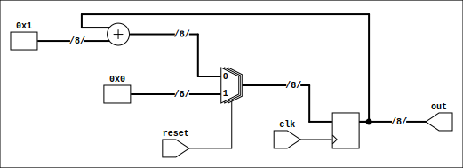

# Digital Computers 2

Table of Contents
=================

* [Digital Computers 2](#digital-computers-2)
   * [1. Repository description](#1-repository-description)
   * [2. Requirements, Usage, and Other projects](#2-requirements-usage-and-other-projects)
   * [3. Acknowledgments](#3-acknowledgments)

Created by [gh-md-toc](https://github.com/ekalinin/github-markdown-toc)

## 1. Repository description

This project aims to provide a fully open-source alternative to the
[Open CourseWare](https://ocw.cs.pub.ro/courses/cn1) Digital Computers 2
Laboratories taught at [Politehnica University of Bucharest](upb.ro), during the
first semester of the university year 2021-2022.

The official guideline recommends using either the Xilinx ISE or Vivado. Since,
both of them are memory heavy (tens of Gb) and closed-source, this repository
was born in order to prove a change is possible.

Here is the list of the improvements I brought:

- `Makefile` with Icarus Simulator support
- Verilator for linting with all warnings managed
    - Some of the members of the PUB team felt like not all Verilator warnings
    were relevant, for example `WIDTH` ones in test benches, but I would like to
    cite other guidelines from [Cornell](https://people.ece.cornell.edu/land/courses/ece5760/Verilog/Verilog_index.html)
    University
        > It is a very good idea to control width. [...] Pay attention to
        > warnings
        - But from `lab-05` and up I chose to invest my time in better
            activities than fixing `WIDTH` warnings
- Correct use of both nonblocking and blocking assignments
- Coding style (as best as I could)
- Improved checkers
- Removed unsynthesizable `initial` blocks which were not used for simulation
    purposes only
- Provided information about open-source tools
- Synthesis script (only for some laboratory tasks)

For more information or a syllabus check out the course description
[page here](https://cs.pub.ro/index.php/education/courses/60-under/an3underg/125-digital-computers-2)
. This course was taught by Dan-Ștefan Tudose.

I encourage you to watch the online lectures
[here](https://www.youtube.com/watch?v=Jj2X13nKH7Y&list=PLwhXkdjzBNZ_2KzgsrSPQ_ZYNhFVFPXWI)
.

## 2. Requirements, Usage, and Other projects

Given that this is a follow up project to the
[Digital Computers 1](https://github.com/mateibarbu19/digital-computers-1)
repo, all the **requirements** and **usage** instruction can be read on it's
description.
Like this repository, it aims to provide a fully open-source alternative to the
[Open CourseWare](https://ocw.cs.pub.ro/courses/cn2) Digital Computers 1
Laboratories (PUB).

## 3. Acknowledgments

I would like to thank our teaching assistant
[Ștefan-Dan Ciocîrlan](https://github.com/sdcioc)
for all his support, this repository would not be possible without him.

Although, I frequently used the pronoun I in this README, I would like to thank 
[Dimitrie David](https://github.com/dimitriedavid/) for helping me with it!
