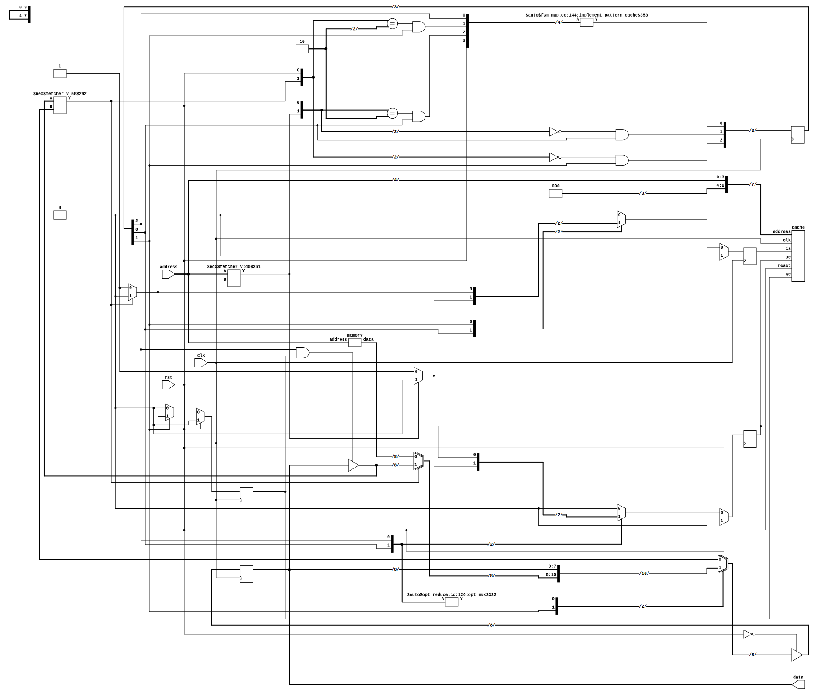

# Digital Computers 2



## Table of Contents

1. [Repository description](#Repository_description)
2. [Requirements](#Requirements)
3. [Usage](#Usage)
4. [Other projects](#Other_projects)
5. [Acknowledgments](#Acknowledgments)

<a name="Repository_description"></a>
## 1. Repository description

This project aims to provide a fully open-source alternative to the
[Open CourseWare](https://ocw.cs.pub.ro/courses/cn1) Digital Computers 2
Laboratories taught at [Politehnica University of Bucharest](upb.ro).

The official guideline recommends using either the Xilinx ISE or Vivado. Since,
both of them are memory heavy (tens of Gb) and closed-source, this repository
was born in order to prove a change is possible.

For more information or a syllabus check out the course description
[page here](https://cs.pub.ro/index.php/education/courses/60-under/an3underg/125-digital-computers-2)
. This course was taught by Dan-Ștefan Tudose.

I encourage you to watch the online lectures
[here](https://www.youtube.com/watch?v=Jj2X13nKH7Y&list=PLwhXkdjzBNZ_2KzgsrSPQ_ZYNhFVFPXWI)
.

<a name="Requirements"></a>
## 2. Requirements

I do recommned you do read the following tutorial first:
[Running Verilog code on Linux/Mac](https://medium.com/macoclock/running-verilog-code-on-linux-mac-3b06ddcccc55).

This project uses [Icarus Verilog](http://iverilog.icarus.com/) for compiling
and simulation. Do note that it was tested only on a Linux platform with
[Make](https://www.gnu.org/software/make/) support. Viewing waveforms can be
done with any program that reads `.vcd` files.

If you would also like to synthesize some of the codes, the only tool I found
was [Yosys](http://www.clifford.at/yosys/). For rendering the generated
schematics you'll need [xdot](https://github.com/jrfonseca/xdot.py) for the
`.dot` files. An alternative is to render the `.json` connection description
with [netlistsvg](https://github.com/nturley/netlistsvg). I recommend you use
the [netlistsvg demo](https://neilturley.dev/netlistsvg/) online without
installing it. (Note: The first example picture in this README was produced by
netlistsvg.)

If you are using a Debian-based system, run the following command to install
the mentioned packages:

```bash
# for building and simulation + waveform viewing
sudo apt install make iverilog gtkwave

# optional, used only for synthesis
# note: depends on xdot
sudo apt install yosys
```

If you are interested in a IDE, I would recomand
[VSCodium](https://vscodium.com/). Install the Verilog-HDL support for VS Code
[extension](https://github.com/mshr-h/vscode-verilog-hdl-support).
If you are a beginner, the [Verilator](https://www.veripool.org/verilator/) 
linter will provide more educational warnings. I configured it with the
following flags in the extension.

```-Wall -Wno-STMTDLY --bbox-unsup```

Do note that you will have to install the linter for this:

```bash
sudo apt install verilator
```

Note: If you took my advice and installed VSCodium, you'll need to enable the VSCode
Marketplace using these
[instructions](https://github.com/VSCodium/vscodium/blob/master/DOCS.md#extensions-marketplace)
.

<a name="Usage"></a>
## Usage

Open the directory corresponding to the laboratory you want to test. Run
`make build` for compiling, `make run` for simulation, and `gtkwave waves.vcd`
for viewing the resulting waveforms.

Some laboratories, like `lab-01/task4`, include a synthesis script. If
you run `make synthesis` in the respective folder, both a `.dot` and `.json`
file will be generated both containing a logic gate schematic circuit based on
the Verilog code. The `.dot` is opened and rendered by default when running the
script. I shall warn you that the `.json` schematic description contains
multiple module implementations, so when using `netlistsvg` just delete from
the `.json` file the unnecessary ones.

<a name="Other_projects"></a>
## 4. Other projects

A precursory to this repository is
[Digital Computers 1](https://github.com/mateibarbu19/digital-computers-1).
Like this repository, it aims to provide a fully open-source alternative to the
[Open CourseWare](https://ocw.cs.pub.ro/courses/cn2) Digital Computers 1
Laboratories (PUB).

<a name="Acknowledgments"></a>
## 5. Acknowledgments

I would like to thank our teaching assistant
[Ștefan-Dan Ciocîrlan](https://github.com/sdcioc)
for all his support, this repository would not be possible without him.

Although, I frequently used the pronoun I in this README, this project is a
group effort so I would like to thank:

- [Cristian Dima](https://github.com/Cartofie)
- [Dimitrie David](https://github.com/dimitriedavid/)
