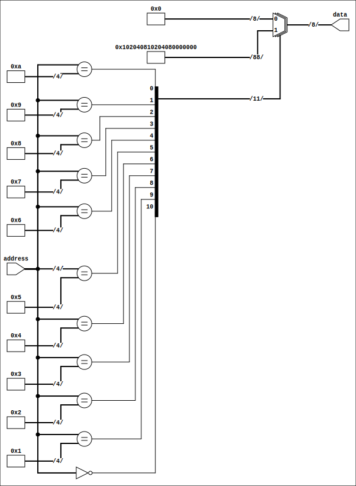
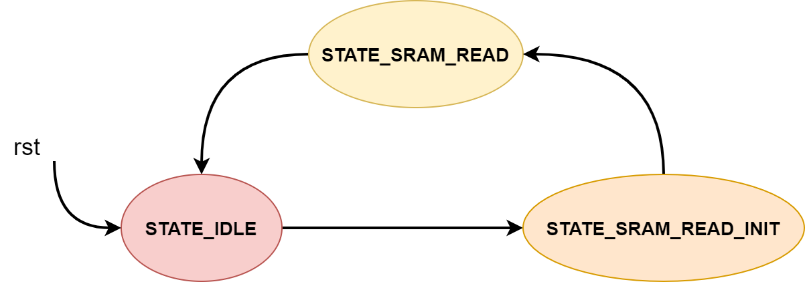

# Laboratory 1 - Memories

## Task 1

> Description: Implement a 16x8 ROM.

Used a combinational block to output constant values for each address. It uses an internal multiplexer.

## Task 2

> Description: Implement a SRAM.

Used a internal array of D flip-flops. Based on the input signal, we write pe a
register `buffer`. We cannot write directly to `data_out`, for it is a wire.

At the last line we use a combinational line assignment from the `buffer` to
`data_out`.

## Task 2

> Description: Implement a SRAM.

Used a internal array of D flip-flops. Based on the input signal, we write pe a
register `buffer`. We cannot write directly to `data_out`, for it is a wire.

At the last line we use a combinational line assignment from the `buffer` to
`data_out`.

## Task 2

> Description: Implement a SRAM with a common write/read pin (bus).

The implementation stays mostly the same. We simply replaced all uses of
`data_in` and `data_out` with data. The difference is rather philosophical.

What happens we we assign a high impedance output on a `inout` pin? Check out an excellent
answer by
[Tom Carpenter](https://electronics.stackexchange.com/users/53368/tom-carpenter),
[What exactly does a High Impedance imply in Verilog?](https://electronics.stackexchange.com/q/219778),
URL (version: 2016-02-28).

## Task 4

> Description: Create a FSM module that gets data from a ROM or SRAM.
> If the data is found in SRAM, it is outputted. Else, we search the ROM for it,
> stash it in the SRAM, and output it.

I feel the code is pretty self explanatory so feel free to check it out.

If you check the waveform you'll see that we get the date with the same one
clock period delay in both retrieving from ROM and SRAM. This is because we
set the read value from the ROM as output and only afterwards do we write to the
SRAM. But we still need to wait another clock period to write to SRAM.

At the moment of writing, pin `B` which connects to the `nex` box, on the left,
in the schematic is a high impedance line. The `mux` pin in which it connects
below is read as a high impedance value.