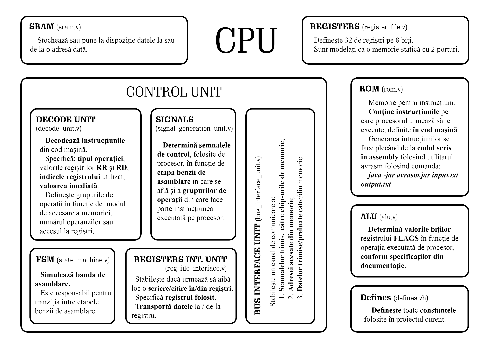

# Laboratory 2



---

# CPU

The `CPU` unit only connects its submodules:

- `control_unit`
- `alu`
- `rom`
- `dual_port_sram`
- `sram`

It also assigns the debug wires, if the `DEBUG` flag was set. It does not
contain any procedural blocks. 

---

## Control Unit

The "brains of this implementation, is responsible for making the connections in the `CPU` module transfer information in a organized fashion.

First of all, it manages the program counter, we will see in the next
laboratories why this is necessary (hint: when we have branches and jumps the
program counter doesn't obey a linear function).

Next, ATTiny 20 has some special registers, `X`, `Y` and `Z`, which need to be
concatenated out of two smaller registers.

It then uses the control signals (which will be explained in a next section) to
make some decisions about when and in what conditions, a write value, for
examples, should be used.

Inside this module, we hold the `SREG` register, the functionality of which is explained in the ISA manual.

This module also buffers and connects values needed by sub and upper modules,
based on which pipeline stage the CPU is at.

Submodules:

- `state_machine`
- `decode_unit`
- `signal_generation_unit`
- `reg_file_interface_unit`
- `bus_interface_unit`

### Finite State Machine

> Description: simulates the pipeline.

It is responsible for the transition between the stages of the pipeline. (It is probably the simplest Verilog file in this folder.)

Code source: `state_machine.v`

### Decode Unit

> Description: decodes instructions from machine code.

Specifies: the type of operation, the values of the RR and RD registers,
the index of the register used, the immediate value.
Defines the groups of operations according to: the way of accessing the memory,
the number of operands or the access to registers.

Code source: `decode_unit.v`

### Signals

> Description: Determines the control signals, used by the processor,
> depending on the stage of the assembly line in which it is located and
> the groups of operations to which the instruction executed on the processor
> belongs.

(The second simplest file in this folder.)

Code source: `signal_generation_unit.v`

### Registers Interface Unit
> Description: determines whether to write/read to/from registers.

If you feel like it's too much to understand, don't worry, I feel the same. But
it's not that hard. Why? Check this out, the `control_unit` is just made up of
little autonomous submodules. The `control_unit` would be too big for everybody
to understand otherwise.

This file basically acts as a middle man between the `control_unit` and
`dual_port_sram`.

Why do we need such a middle man? Because we need to interpret the decoded
bit's outputted by the `decode_unit` and signals. It helps know when is the
right time to transfer data/to and from the registers, and at what addresses.

Code source: `reg_file_interface.v`

### Bus Interface Unit

> Description: establishes a communication channel between the `control_unit` and `sram` modules. 

It consists of:

1. Signals sent to memory chips
2. Address accessed from memory
3. Data sent/retrieved to/from memory

Code source: `bus_interface_unit.v`

---

## ALU

> Description: determines the bit values ​​of the FLAGS register depending on
> the operation performed by the processor, according to the specifications in
> the documentation

Code source: `alu.v`

## Defines

> Description: defines all constants used in the current project

Code source: `defines.vh`

---

## Registers

> Description: defines 32 8-bit registers.

They are modeled as a static memory with 2 ports

Code source: `register_file.v`

## SRAM

> Description: stores and delivers to or from a specific address.

Because our implementation is microcontroller has a Harvard architecture, the
working memory, stored in the `sram` module, is separated from the instruction
memory, stored in the `rom` module.

Code source: `sram.v`

## ROM

> Description: contains the instructions that the processor is to execute,
> defined in the machine code.

The generation of the instructions is done starting from the code written in
assembly using the avrasm utility using the command:

```shell
java -jar avrasm.jar input.txt output.txt
```

Code source: `rom.v`